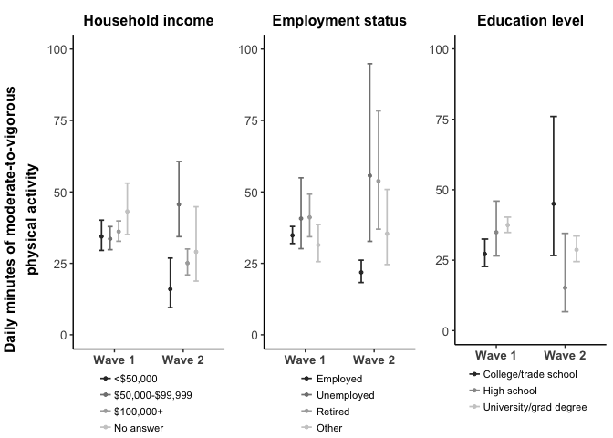

# Paper 1: Analysis

## 1. Prepare data

### Sensdoc data

Read in SD TOP: 

```r
  sd_pa<-read.csv("Data//final-for-analysis//sensdoc-wearing-2023.csv") # 5575
```

### Set levels for categorical variables (and re-categorize per MW comments)

Format date as date

```r
  sd_pa$date<-as.Date(sd_pa$date)
```

Age category (other paper used 18-24, 25-44, 45 to 64, and 65+)

```
## 
## 18-29 30-49 50-69   70+ 
##   725  2039  2010   736
```

Income. Combine <50,000 into one category and re-order the levels 

```
##                        <$50,000              $50,000 to $99,999 
##                            1109                            1475 
##                $100,000 or more don't know/prefer not to answer 
##                            2439                             552
```

Gender:  

```
##   man woman other 
##  1896  3584    95
```

Children: 

```
##  yes   no 
## 2899 2676
```

Employment status

```
##                employed retired and not working              unemployed 
##                    3621                    1130                     262 
##                   other 
##                     562
```

Education: 

```
##   university or graduate degree                secondary school 
##                            4384                             376 
##         trade school or college don't know/prefer not to answer 
##                             767                              48
```

Create categorical stringency index, for assessing balance across levels of stringency 

```r
  summary(sd_pa[sd_pa$wave_id=="wave 2",]$stringencyIndex)
```

```
##    Min. 1st Qu.  Median    Mean 3rd Qu.    Max.    NA's 
##   25.90   39.40   47.00   45.48   50.70   66.80       7
```

```r
    # min = 25.90, 1st qu. = 39.40, median = 47.00, 3rd qu. = 50.70, max = 66.80

# create a categorical version: <40, 40-50, >50
  sd_pa$si_cat<-as.factor(ifelse(sd_pa$stringencyIndex <= 41, "0-41",
                          ifelse(sd_pa$stringencyIndex > 41 & sd_pa$stringencyIndex <=47, "42-47",
                          ifelse(sd_pa$stringencyIndex > 47, "48-100",NA))))
  summary(sd_pa[sd_pa$wave_id=="wave 2",]$si_cat)
```

```
##   0-41  42-47 48-100   NA's 
##    503    432    514      7
```

### Data cleaning: Creating sub-samples

*sd_ppl: Person-level dataset*: used in version 1 of Table 1 (with person-level characteristics)

```r
  sd_ppl<-sd_pa %>% ungroup() %>% 
                    dplyr::select(interact_id,income,gender,age,age_cat,children,
                           education,employment,wave_id,city_id,both)
  sd_ppl<-distinct(sd_ppl)
  table(sd_ppl$wave_id,sd_ppl$city_id) # one participant from Saskatoon in wave 1 has gone missing?
```

```
##         
##          montreal saskatoon vancouver
##   wave 1      159        85       150
##   wave 2       44        26        79
```

*sd_valid: Participant-days of data with >= 600 minutes of wear time*: this is used in the main analyses and table 1

```r
  sd_valid<-sd_pa[sd_pa$wear>=600,]
  length(sd_pa[sd_pa$wear<600,]$interact_id)
```

```
## [1] 2315
```

*sd_valid_ppl: People with at least one valid participant-day (>= 600 minutes of wear time)*

```r
  sd_ppl_valid<-sd_valid %>% ungroup() %>% 
                    dplyr::select(interact_id,income,gender,age,age_cat,children,
                           education,employment,wave_id,city_id,both)
  sd_ppl_valid<-distinct(sd_ppl_valid)
  table(sd_ppl_valid$wave_id) # one participant from Saskatoon in wave 1 has gone missing?
```

```
## 
## wave 1 wave 2 
##    386     65
```


*sd_valid_both: valid person-days from participants that contributed at least one day of VALID data in both waves* this is used for sensitivity analysis I: filtered to valid person-days (sd_valid) and then filtered to participants with data in both waves (sd_valid_both) 

```r
  valid_both_waves<-sd_valid %>% dplyr::select(interact_id,wave_id) %>% distinct() %>% 
                                        group_by(interact_id) %>%
                                        mutate(count=length(unique(wave_id))) %>% filter(count>1)
  sd_valid_both<-sd_valid[sd_valid$interact_id %in% valid_both_waves[valid_both_waves$count==2,]$interact_id ,]
  length(unique(sd_valid_both$interact_id))
```

```
## [1] 35
```

### Stringency index

Read in data

```r
  si<-read.csv("./Data/IRPP stringency index/2021 09 22 INDEX Centre of Excellence COVID Policy Data_New Codebook.csv")
  si$date<-as.Date(si$date)
  si$province<-si$Province.Territory
```

Rescale stringencyIndex by dividing values by 10

```r
  si$stringencyIndex<-si$stringencyIndex/10
  sd_pa$stringencyIndex<-sd_pa$stringencyIndex/10
```

Rescale wear time

```r
  sd_pa$wearRS<-sd_pa$wear/100
  sd_valid$wearRS<-sd_valid$wear/100
```

Plot of stringency index over time (in black and white)
<!-- -->


## 2. Assess for balance across exposures

### Create Table 1:

*Columns 1 and 2: participants who contributed at least one valid day of data, by wave (sd_ppl_valid)*

|                                |wave 1     |wave 2    |
|:-------------------------------|:----------|:---------|
|n                               |386        |65        |
|city_id (%)                     |           |          |
|montreal                        |158 (40.9) |19 (29.2) |
|saskatoon                       |81 (21.0)  |18 (27.7) |
|vancouver                       |147 (38.1) |28 (43.1) |
|gender (%)                      |           |          |
|man                             |131 (33.9) |22 (33.8) |
|woman                           |252 (65.3) |40 (61.5) |
|other                           |3 ( 0.8)   |3 ( 4.6)  |
|age_cat (%)                     |           |          |
|18-29                           |55 (14.2)  |10 (15.4) |
|30-49                           |142 (36.8) |30 (46.2) |
|50-69                           |132 (34.2) |21 (32.3) |
|70+                             |51 (13.2)  |4 ( 6.2)  |
|NA                              |6 ( 1.6)   |0 ( 0.0)  |
|income (%)                      |           |          |
|<$50,000                        |81 (21.0)  |7 (10.8)  |
|$50,000 to $99,999              |107 (27.7) |17 (26.2) |
|$100,000 or more                |162 (42.0) |35 (53.8) |
|don't know/prefer not to answer |36 ( 9.3)  |6 ( 9.2)  |
|children = no (%)               |179 (46.4) |34 (52.3) |
|education (%)                   |           |          |
|university or graduate degree   |300 (77.7) |56 (86.2) |
|secondary school                |27 ( 7.0)  |3 ( 4.6)  |
|trade school or college         |55 (14.2)  |6 ( 9.2)  |
|don't know/prefer not to answer |4 ( 1.0)   |0 ( 0.0)  |
|employment (%)                  |           |          |
|employed                        |256 (66.3) |44 (67.7) |
|retired and not working         |77 (19.9)  |9 (13.8)  |
|unemployed                      |16 ( 4.1)  |5 ( 7.7)  |
|other                           |37 ( 9.6)  |7 (10.8)  |

*Columns 3 and 4: valid person-days, by wave (sd_valid)*
Wear time and city are very different between waves. Some differences in age (older in wave 2), some differences in income (fewer young people, more older people in wave 2) (vs. sd_pa: all person-days, by wave)
filtering out invalid days introduces an imbalance in education levels
different: wear, city, age, income, employment status, education 

|                                |wave 1          |wave 2         |
|:-------------------------------|:---------------|:--------------|
|n                               |3010            |250            |
|wear (mean (SD))                |820.68 (101.37) |725.18 (87.30) |
|mean_mvpa_sd (mean (SD))        |43.49 (36.31)   |35.15 (34.31)  |
|mean_temp (mean (SD))           |11.15 (11.82)   |1.84 (8.80)    |
|total_precip (mean (SD))        |1.84 (4.77)     |2.94 (5.73)    |
|city_id (%)                     |                |               |
|montreal                        |1263 (42.0)     |73 (29.2)      |
|saskatoon                       |555 (18.4)      |68 (27.2)      |
|vancouver                       |1192 (39.6)     |109 (43.6)     |
|gender (%)                      |                |               |
|man                             |1044 (34.7)     |84 (33.6)      |
|woman                           |1940 (64.5)     |150 (60.0)     |
|other                           |26 ( 0.9)       |16 ( 6.4)      |
|age_cat (%)                     |                |               |
|18-29                           |426 (14.2)      |24 ( 9.6)      |
|30-49                           |1091 (36.2)     |118 (47.2)     |
|50-69                           |1036 (34.4)     |90 (36.0)      |
|70+                             |427 (14.2)      |18 ( 7.2)      |
|NA                              |30 ( 1.0)       |0 ( 0.0)       |
|income (%)                      |                |               |
|<$50,000                        |574 (19.1)      |15 ( 6.0)      |
|$50,000 to $99,999              |849 (28.2)      |64 (25.6)      |
|$100,000 or more                |1300 (43.2)     |148 (59.2)     |
|don't know/prefer not to answer |287 ( 9.5)      |23 ( 9.2)      |
|children = no (%)               |1402 (46.6)     |127 (50.8)     |
|education (%)                   |                |               |
|university or graduate degree   |2389 (79.4)     |224 (89.6)     |
|secondary school                |167 ( 5.5)      |6 ( 2.4)       |
|trade school or college         |434 (14.4)      |20 ( 8.0)      |
|don't know/prefer not to answer |20 ( 0.7)       |0 ( 0.0)       |
|employment (%)                  |                |               |
|employed                        |2000 (66.4)     |166 (66.4)     |
|retired and not working         |633 (21.0)      |35 (14.0)      |
|unemployed                      |93 ( 3.1)       |11 ( 4.4)      |
|other                           |284 ( 9.4)      |38 (15.2)      |

*Columns 5 and 6: valid participant-days from wave 2, stratified by stringency index (sd_valid)*: 
CLEAR imbalances of gender, age, kids, education and employment status (not income)

|                                |0-41           |42-47           |48-100         |
|:-------------------------------|:--------------|:---------------|:--------------|
|n                               |91             |67              |92             |
|wear (mean (SD))                |735.22 (84.98) |733.51 (103.74) |709.18 (74.12) |
|mean_mvpa_sd (mean (SD))        |35.96 (35.10)  |28.91 (31.60)   |38.90 (35.14)  |
|mean_temp (mean (SD))           |1.18 (8.10)    |-1.36 (10.82)   |4.83 (6.71)    |
|total_precip (mean (SD))        |2.04 (5.72)    |4.26 (6.63)     |2.87 (4.84)    |
|city_id (%)                     |               |                |               |
|montreal                        |0 ( 0.0)       |0 ( 0.0)        |73 (79.3)      |
|saskatoon                       |47 (51.6)      |21 (31.3)       |0 ( 0.0)       |
|vancouver                       |44 (48.4)      |46 (68.7)       |19 (20.7)      |
|gender (%)                      |               |                |               |
|man                             |33 (36.3)      |26 (38.8)       |25 (27.2)      |
|woman                           |55 (60.4)      |41 (61.2)       |54 (58.7)      |
|other                           |3 ( 3.3)       |0 ( 0.0)        |13 (14.1)      |
|age_cat (%)                     |               |                |               |
|18-29                           |6 ( 6.6)       |7 (10.4)        |11 (12.0)      |
|30-49                           |32 (35.2)      |29 (43.3)       |57 (62.0)      |
|50-69                           |37 (40.7)      |29 (43.3)       |24 (26.1)      |
|70+                             |16 (17.6)      |2 ( 3.0)        |0 ( 0.0)       |
|NA                              |0 ( 0.0)       |0 ( 0.0)        |0 ( 0.0)       |
|income (%)                      |               |                |               |
|<$50,000                        |8 ( 8.8)       |7 (10.4)        |0 ( 0.0)       |
|$50,000 to $99,999              |21 (23.1)      |14 (20.9)       |29 (31.5)      |
|$100,000 or more                |55 (60.4)      |33 (49.3)       |60 (65.2)      |
|don't know/prefer not to answer |7 ( 7.7)       |13 (19.4)       |3 ( 3.3)       |
|children = no (%)               |52 (57.1)      |32 (47.8)       |43 (46.7)      |
|education (%)                   |               |                |               |
|university or graduate degree   |80 (87.9)      |61 (91.0)       |83 (90.2)      |
|secondary school                |2 ( 2.2)       |4 ( 6.0)        |0 ( 0.0)       |
|trade school or college         |9 ( 9.9)       |2 ( 3.0)        |9 ( 9.8)       |
|don't know/prefer not to answer |0 ( 0.0)       |0 ( 0.0)        |0 ( 0.0)       |
|employment (%)                  |               |                |               |
|employed                        |55 (60.4)      |49 (73.1)       |62 (67.4)      |
|retired and not working         |27 (29.7)      |3 ( 4.5)        |5 ( 5.4)       |
|unemployed                      |8 ( 8.8)       |2 ( 3.0)        |1 ( 1.1)       |
|other                           |1 ( 1.1)       |13 (19.4)       |24 (26.1)      |

### Create Supplementary Table 1: 

*Columns 1 and 2: Participants with at least one valid day of data in BOTH waves (objective 1, sensitivity analysis I; sd_valid_both*: 
imbalances are slightly different here, too. In theory, this group should be the same in both waves, but this is a person-day dataset and there are people who contributed different number of (valid) days in each wave
different: wear, gender, income, 
same: city, education, employment, kids 

|                                |wave 1         |wave 2         |
|:-------------------------------|:--------------|:--------------|
|n                               |311            |148            |
|wear (mean (SD))                |843.07 (95.86) |723.58 (79.70) |
|mean_mvpa_sd (mean (SD))        |53.56 (41.16)  |36.53 (36.51)  |
|mean_temp (mean (SD))           |11.55 (11.55)  |4.51 (7.43)    |
|total_precip (mean (SD))        |1.11 (3.50)    |3.46 (6.13)    |
|city_id (%)                     |               |               |
|montreal                        |85 (27.3)      |42 (28.4)      |
|saskatoon                       |70 (22.5)      |35 (23.6)      |
|vancouver                       |156 (50.2)     |71 (48.0)      |
|gender (%)                      |               |               |
|man                             |131 (42.1)     |56 (37.8)      |
|woman                           |171 (55.0)     |79 (53.4)      |
|other                           |9 ( 2.9)       |13 ( 8.8)      |
|age_cat (%)                     |               |               |
|18-29                           |39 (12.5)      |8 ( 5.4)       |
|30-49                           |137 (44.1)     |56 (37.8)      |
|50-69                           |116 (37.3)     |69 (46.6)      |
|70+                             |19 ( 6.1)      |15 (10.1)      |
|income (%)                      |               |               |
|<$50,000                        |50 (16.1)      |7 ( 4.7)       |
|$50,000 to $99,999              |60 (19.3)      |31 (20.9)      |
|$100,000 or more                |150 (48.2)     |97 (65.5)      |
|don't know/prefer not to answer |51 (16.4)      |13 ( 8.8)      |
|children = no (%)               |150 (48.2)     |66 (44.6)      |
|education (%)                   |               |               |
|university or graduate degree   |284 (91.3)     |136 (91.9)     |
|secondary school                |9 ( 2.9)       |2 ( 1.4)       |
|trade school or college         |18 ( 5.8)      |10 ( 6.8)      |
|don't know/prefer not to answer |0 ( 0.0)       |0 ( 0.0)       |
|employment (%)                  |               |               |
|employed                        |197 (63.3)     |94 (63.5)      |
|retired and not working         |55 (17.7)      |26 (17.6)      |
|unemployed                      |24 ( 7.7)      |8 ( 5.4)       |
|other                           |35 (11.3)      |20 (13.5)      |

*Columns 3 and 4: Valid person-days collected between October 3 and February 20 (objective 1, sensitivity analysis II; sd_valid)*

|                                |wave 1          |wave 2         |
|:-------------------------------|:---------------|:--------------|
|n                               |1131            |244            |
|wear (mean (SD))                |812.89 (106.36) |726.47 (87.53) |
|mean_mvpa_sd (mean (SD))        |38.54 (31.84)   |35.21 (34.68)  |
|mean_temp (mean (SD))           |-1.51 (9.62)    |1.76 (8.89)    |
|total_precip (mean (SD))        |2.15 (5.06)     |2.98 (5.79)    |
|city_id (%)                     |                |               |
|montreal                        |374 (33.1)      |73 (29.9)      |
|saskatoon                       |555 (49.1)      |68 (27.9)      |
|vancouver                       |202 (17.9)      |103 (42.2)     |
|gender (%)                      |                |               |
|man                             |322 (28.5)      |84 (34.4)      |
|woman                           |792 (70.0)      |144 (59.0)     |
|other                           |17 ( 1.5)       |16 ( 6.6)      |
|age_cat (%)                     |                |               |
|18-29                           |290 (26.3)      |24 ( 9.8)      |
|30-49                           |483 (43.9)      |112 (45.9)     |
|50-69                           |291 (26.4)      |90 (36.9)      |
|70+                             |37 ( 3.4)       |18 ( 7.4)      |
|income (%)                      |                |               |
|<$50,000                        |276 (24.4)      |15 ( 6.1)      |
|$50,000 to $99,999              |344 (30.4)      |64 (26.2)      |
|$100,000 or more                |412 (36.4)      |142 (58.2)     |
|don't know/prefer not to answer |99 ( 8.8)       |23 ( 9.4)      |
|children = no (%)               |594 (52.5)      |121 (49.6)     |
|education (%)                   |                |               |
|university or graduate degree   |914 (80.8)      |218 (89.3)     |
|secondary school                |100 ( 8.8)      |6 ( 2.5)       |
|trade school or college         |106 ( 9.4)      |20 ( 8.2)      |
|don't know/prefer not to answer |11 ( 1.0)       |0 ( 0.0)       |
|employment (%)                  |                |               |
|employed                        |875 (77.4)      |166 (68.0)     |
|retired and not working         |100 ( 8.8)      |35 (14.3)      |
|unemployed                      |55 ( 4.9)       |11 ( 4.5)      |
|other                           |101 ( 8.9)      |32 (13.1)      |

Rescale temperature and precipitation

```r
  sd_pa$total_precip<-sd_pa$total_precip/10
  sd_pa$mean_temp<-sd_pa$mean_temp/10
```


## 3. OBJECTIVE 1: Impact of the pandemic on daily MVPA

### Descriptive figures

**Figure 1**: Distribution of daily minutes of wear time and moderate-to-vigorous physical activity among valid person-days, by wave
<!-- -->

**Figure 2:** Trend in daily minutes of moderate-to-vigorous physical activity for each wave
<!-- -->


### I. Main effect models (results presented in Table 2)

#### Unadjusted model (Table 2, Row 1)

*Model*

```r
  wave_abs_valid_unadj<-glmer.nb(mean_mvpa_sd~ wave_id + (1|interact_id),
                                 data=sd_valid) 
  #summary(wave_abs_valid_unadj)
```

*Results*

```
## [1] "effect estimate: 0.65930825508699"
```

```
## [1] "confidence interval: "
```

```
##                   2.5 %    97.5 %
## wave_idwave 2 0.5765839 0.7547372
```

#### Adjusted for unbalanced factors (Table 2, Row 2)

*Assess for balance betwween waves to determine that to adjust for in the adjusted model*

|                                |wave 1          |wave 2         |
|:-------------------------------|:---------------|:--------------|
|n                               |3010            |250            |
|wear (mean (SD))                |820.68 (101.37) |725.18 (87.30) |
|mean_mvpa_sd (mean (SD))        |43.49 (36.31)   |35.15 (34.31)  |
|mean_temp (mean (SD))           |11.15 (11.82)   |1.84 (8.80)    |
|total_precip (mean (SD))        |1.84 (4.77)     |2.94 (5.73)    |
|city_id (%)                     |                |               |
|montreal                        |1263 (42.0)     |73 (29.2)      |
|saskatoon                       |555 (18.4)      |68 (27.2)      |
|vancouver                       |1192 (39.6)     |109 (43.6)     |
|gender (%)                      |                |               |
|man                             |1044 (34.7)     |84 (33.6)      |
|woman                           |1940 (64.5)     |150 (60.0)     |
|other                           |26 ( 0.9)       |16 ( 6.4)      |
|age_cat (%)                     |                |               |
|18-29                           |426 (14.2)      |24 ( 9.6)      |
|30-49                           |1091 (36.2)     |118 (47.2)     |
|50-69                           |1036 (34.4)     |90 (36.0)      |
|70+                             |427 (14.2)      |18 ( 7.2)      |
|NA                              |30 ( 1.0)       |0 ( 0.0)       |
|income (%)                      |                |               |
|<$50,000                        |574 (19.1)      |15 ( 6.0)      |
|$50,000 to $99,999              |849 (28.2)      |64 (25.6)      |
|$100,000 or more                |1300 (43.2)     |148 (59.2)     |
|don't know/prefer not to answer |287 ( 9.5)      |23 ( 9.2)      |
|children = no (%)               |1402 (46.6)     |127 (50.8)     |
|education (%)                   |                |               |
|university or graduate degree   |2389 (79.4)     |224 (89.6)     |
|secondary school                |167 ( 5.5)      |6 ( 2.4)       |
|trade school or college         |434 (14.4)      |20 ( 8.0)      |
|don't know/prefer not to answer |20 ( 0.7)       |0 ( 0.0)       |
|employment (%)                  |                |               |
|employed                        |2000 (66.4)     |166 (66.4)     |
|retired and not working         |633 (21.0)      |35 (14.0)      |
|unemployed                      |93 ( 3.1)       |11 ( 4.4)      |
|other                           |284 ( 9.4)      |38 (15.2)      |

*Model: Adjusting for city, age, employment status, income, temp, precipitation and wear time*

```r
  wave_covar_valid_fully<-glmer.nb(mean_mvpa_sd~ wave_id + city_id + wearRS +
                                                 age_cat + employment + income +
                                                 mean_temp + total_precip + 
                                                 (1|interact_id),
                          data=sd_valid[sd_valid$age_cat!="missing",])
```

*Results*

```
## [1] "effect estimate: 0.788590701604999"
```

```
## [1] "confidence interval: "
```

```
##                   2.5 %    97.5 %
## wave_idwave 2 0.6812663 0.9137029
```


### II. Sensitivity analyses (Supplementary Table 2)

#### A. Sensitivity analysis 1 (Supplementary Table 2, Row 2) 

Participants-days from participants that contributed data in both waves with 600+ minutes of wear time, adjusted for unbalanced factors (gender, age, household income, mean daily temperature, daily precipitation, daily wear time)

**Model**

```r
  both_valid_adj_wear<-glmer.nb(mean_mvpa_sd~ wave_id + 
                                              gender + age_cat + income +
                                              mean_temp + total_precip + wear +
                                       (1|interact_id),
                          data=sd_valid_both) 
```

**Results**

```
## [1] "effect estimate: 0.81"
```

```
## [1] "confidence interval: "
```

```
##               2.5 % 97.5 %
## wave_idwave 2  0.63   1.02
```

```
##                           (Intercept)                         wave_idwave 2 
##                                 454.0                                 147.0 
##                           genderwoman                           genderother 
##                                 248.0                                  22.0 
##                          age_cat30-49                          age_cat50-69 
##                                 190.0                                 184.0 
##                            age_cat70+              income$50,000 to $99,999 
##                                  34.0                                  88.0 
##                income$100,000 or more incomedon't know/prefer not to answer 
##                                 245.0                                  64.0 
##                             mean_temp                          total_precip 
##                                4208.2                                 850.7 
##                                  wear 
##                              365119.0
```

#### B. Sensitivity analysis 2 (Supplementary Table 2, Row 3)

Filter data from wave 1 and wave 2 to the same date range

**Dates of data collection for wave 1 vs. wave 2**

```
## [1] "dates for wave 1 data collection: 2018-05-03 to 2019-02-20"
```

```
## [1] "dates for wave 2 data collection: 2020-10-03 to 2021-02-27"
```

**Create new dataframe restricted to valid days between October 3 and February 20 (the range of dates on which person-days with 600+ minutes of wear time begin)**

```r
  sens_valid<-sd_valid[(sd_valid$wave_id == "wave 1" & sd_valid$date >= "2018-10-03") |
                       (sd_valid$wave_id == "wave 2" & sd_valid$date <= "2021-02-20"),]
```

**Double check new data frame: Note the time frame matches for both wave 1 and wave 2**

```
## [1] "dates for wave 1 data collection: 2018-10-03 to 2019-02-20"
```

```
## [1] "dates for wave 2 data collection: 2020-10-03 to 2021-02-20"
```

**Model**

```r
  wave_covar_valid_fully_sens<-glmer.nb(mean_mvpa_sd~ wave_id +
                                                      gender + age_cat + employment + income + education +
                                                      city_id + wear +
                                       (1|interact_id),
                          data=sens_valid[sens_valid$age_cat!="missing",])
  summary(wave_covar_valid_fully_sens)
```

```
## Generalized linear mixed model fit by maximum likelihood (Laplace
##   Approximation) [glmerMod]
##  Family: Negative Binomial(1.9974)  ( log )
## Formula: mean_mvpa_sd ~ wave_id + gender + age_cat + employment + income +  
##     education + city_id + wear + (1 | interact_id)
##    Data: sens_valid[sens_valid$age_cat != "missing", ]
## 
##      AIC      BIC   logLik deviance df.resid 
##  12199.9  12309.2  -6079.0  12157.9     1324 
## 
## Scaled residuals: 
##     Min      1Q  Median      3Q     Max 
## -1.3816 -0.6576 -0.0935  0.4770  4.4700 
## 
## Random effects:
##  Groups      Name        Variance Std.Dev.
##  interact_id (Intercept) 0.2309   0.4805  
## Number of obs: 1345, groups:  interact_id, 210
## 
## Fixed effects:
##                                            Estimate Std. Error z value Pr(>|z|)
## (Intercept)                               2.9037202  0.2491714  11.654  < 2e-16
## wave_idwave 2                            -0.1868756  0.0902012  -2.072  0.03829
## genderwoman                              -0.1754378  0.0950386  -1.846  0.06490
## genderother                               0.1203888  0.2474386   0.487  0.62658
## age_cat30-49                             -0.2274509  0.1072914  -2.120  0.03401
## age_cat50-69                             -0.2330127  0.1288121  -1.809  0.07046
## age_cat70+                               -0.3354464  0.2693052  -1.246  0.21291
## employmentretired and not working         0.0926323  0.1738096   0.533  0.59407
## employmentunemployed                      0.2283605  0.1619024   1.410  0.15840
## employmentother                           0.1090592  0.1447041   0.754  0.45105
## income$50,000 to $99,999                  0.1906583  0.1250090   1.525  0.12722
## income$100,000 or more                    0.0339898  0.1241343   0.274  0.78423
## incomedon't know/prefer not to answer     0.0941126  0.1633901   0.576  0.56462
## educationsecondary school                -0.1079158  0.1663958  -0.649  0.51663
## educationtrade school or college         -0.2566980  0.1599001  -1.605  0.10841
## educationdon't know/prefer not to answer -0.0320129  0.5620542  -0.057  0.95458
## city_idsaskatoon                         -0.2752043  0.1022789  -2.691  0.00713
## city_idvancouver                          0.2662557  0.1185154   2.247  0.02467
## wear                                      0.0010957  0.0002329   4.705 2.54e-06
##                                             
## (Intercept)                              ***
## wave_idwave 2                            *  
## genderwoman                              .  
## genderother                                 
## age_cat30-49                             *  
## age_cat50-69                             .  
## age_cat70+                                  
## employmentretired and not working           
## employmentunemployed                        
## employmentother                             
## income$50,000 to $99,999                    
## income$100,000 or more                      
## incomedon't know/prefer not to answer       
## educationsecondary school                   
## educationtrade school or college            
## educationdon't know/prefer not to answer    
## city_idsaskatoon                         ** 
## city_idvancouver                         *  
## wear                                     ***
## ---
## Signif. codes:  0 '***' 0.001 '**' 0.01 '*' 0.05 '.' 0.1 ' ' 1
## optimizer (Nelder_Mead) convergence code: 0 (OK)
## Model failed to converge with max|grad| = 0.0163176 (tol = 0.002, component 1)
## Model is nearly unidentifiable: very large eigenvalue
##  - Rescale variables?
## Model is nearly unidentifiable: large eigenvalue ratio
##  - Rescale variables?
```

**Results**

```
## [1] "effect estimate: 0.83"
```

```
## [1] "confidence interval: "
```

```
##               2.5 % 97.5 %
## wave_idwave 2   0.7   0.99
```


### III. Effect modification 

#### Assess for effect modification (Supplementary Table 3)

I'll run stratified models to determine if the effect size or direction of the exposure variable (wave_id) varies across levels of each independent variable. These models will be run on valid person-days (600+ minutes of wear time) from both waves. 

**Overall, for reference (row 1 supplementary table 2)**

```
## [1] "overall:  0.75"
```

**Gender**


Distribution of person-days by wave and gender

```
##        
##         wave 1 wave 2  Sum
##   man     1044     84 1128
##   woman   1940    150 2090
##   other     26     16   42
##   Sum     3010    250 3260
```

Effect estimate and CI for each strata

```
## [1] "men: 0.76 (0.6, 0.94)"
```

```
## [1] "women: 0.73 (0.61, 0.87)"
```


**Age**


Distribution of person-days by wave and age

```
##        
##         wave 1 wave 2  Sum
##   18-29    426     24  450
##   30-49   1091    118 1209
##   50-69   1036     90 1126
##   70+      427     18  445
##   Sum     2980    250 3230
```

Effect estimate and CI for each strata

```
## [1] "18-29: 0.7 (0.46, 1.02)"
```

```
## [1] "30-49: 0.67 (0.54, 0.82)"
```

```
## [1] "50-69: 0.77 (0.61, 0.95)"
```

```
## [1] "70+: 0.87 (0.49, 1.5)"
```


**Income**


Distribution of person-days by wave and income

```
##                                  
##                                   wave 1 wave 2  Sum
##   <$50,000                           574     15  589
##   $50,000 to $99,999                 849     64  913
##   $100,000 or more                  1300    148 1448
##   don't know/prefer not to answer    287     23  310
##   Sum                               3010    250 3260
```

Effect estimate and CI for each strata

```
## [1] "<$50,000: 0.41 (0.22, 0.68)"
```

```
## [1] "$50,000 to $99,999: 1.31 (0.92, 1.76)"
```

```
## [1] "$100,000 or more: 0.76 (0.61, 0.9)"
```

```
## [1] "don't know/prefer not to answer: 0.53 (0.33, 0.85)"
```


**Education**


Distribution of person-days by wave and education

```
##                                  
##                                   wave 1 wave 2  Sum
##   university or graduate degree     2389    224 2613
##   secondary school                   167      6  173
##   trade school or college            434     20  454
##   don't know/prefer not to answer     20      0   20
##   Sum                               3010    250 3260
```

Effect estimate and CI for each strata

```
## [1] "university or graduate degree: 0.72 (0.62, 0.82)"
```

```
## [1] "secondary school: 0.38 (0.16, 0.9)"
```

```
## [1] "trade school or college: 1.73 (1.06, 2.8)"
```

**Employment status**


Distribution of person-days by wave and employment

```
##                          
##                           wave 1 wave 2  Sum
##   employed                  2000    166 2166
##   retired and not working    633     35  668
##   unemployed                  93     11  104
##   other                      284     38  322
##   Sum                       3010    250 3260
```

Effect estimate and CI for each strata

```
## [1] "employed: 0.63 (0.52, 0.74)"
```

```
## [1] "retired and not working: 1.18 (0.78, 1.74)"
```

```
## [1] "unemployed: 1.07 (0.63, 1.87)"
```

```
## [1] "other: 0.97 (0.59, 1.58)"
```

**Has children**


Distribution of person-days by wave and employment

```
##      
##       wave 1 wave 2  Sum
##   yes   1608    123 1731
##   no    1402    127 1529
##   Sum   3010    250 3260
```

Effect estimate and CI for each strata

```
## [1] "has children at home: 0.78 (0.62, 0.95)"
```

```
## [1] "does not have children at home:0.7 (0.58, 0.84)"
```

**City**


Distribution of person-days by wave and employment

```
##            
##             wave 1 wave 2  Sum
##   montreal    1263     73 1336
##   saskatoon    555     68  623
##   vancouver   1192    109 1301
##   Sum         3010    250 3260
```

Effect estimate and CI for each strata

```
## [1] "montreal: 0.75 (0.58, 0.95)"
```

```
## [1] "saskatoon: 0.82 (0.61, 1.07)"
```

```
## [1] "vancouver: 0.66 (0.53, 0.8)"
```

#### Plot effect modifiers of interest (Figure 3): Income, employment status and education

Plot interaction effect using effects package (https://cran.r-project.org/web/packages/effects/effects.pdf)

Note: these models are run on person-days with 600+ minutes of wear time and thus we'll control for factors that are unbalanced within this sub-sample

**Create income plot**


**Create education plot**


**Create employment figure**


**Create Figure 3**
<!-- -->


## 4. OBJECTIVE 2: Impact of lockdown stringency on daily MVPA

### A. Main effects 

#### Unadjusted model (row 1 table 3)

```
## [1] 1456
```

```
## [1] 7
```

**Model**

```r
# model is missing 7 observations from wave 2?
  si_all_unadj<-glmer.nb(mean_mvpa_sd~ stringencyIndex + (1|interact_id),
                         data=sd_pa[sd_pa$wave_id=="wave 2",]) 
  summary(si_all_unadj)
```

```
## Generalized linear mixed model fit by maximum likelihood (Laplace
##   Approximation) [glmerMod]
##  Family: Negative Binomial(0.7023)  ( log )
## Formula: mean_mvpa_sd ~ stringencyIndex + (1 | interact_id)
##    Data: sd_pa[sd_pa$wave_id == "wave 2", ]
## 
##      AIC      BIC   logLik deviance df.resid 
##  12008.6  12029.7  -6000.3  12000.6     1445 
## 
## Scaled residuals: 
##     Min      1Q  Median      3Q     Max 
## -0.8334 -0.6712 -0.2190  0.3961  6.4522 
## 
## Random effects:
##  Groups      Name        Variance Std.Dev.
##  interact_id (Intercept) 0.6774   0.8231  
## Number of obs: 1449, groups:  interact_id, 149
## 
## Fixed effects:
##                 Estimate Std. Error z value Pr(>|z|)    
## (Intercept)     2.914516   0.457288   6.373 1.85e-10 ***
## stringencyIndex 0.009502   0.098925   0.096    0.923    
## ---
## Signif. codes:  0 '***' 0.001 '**' 0.01 '*' 0.05 '.' 0.1 ' ' 1
## 
## Correlation of Fixed Effects:
##             (Intr)
## strngncyInd -0.986
```

**Results**

```
## [1] 1.009547
```

```
##                    2.5 %   97.5 %
## stringencyIndex 0.830039 1.225927
```


#### Fully adjusted (row 2 table 3)

**Model**

```r
  si_all_cov_fully<-glmer.nb(mean_mvpa_sd~ stringencyIndex + wear + city_id + 
                          mean_temp + total_precip + 
                          age_cat + 
                          gender + 
                          children + 
                          employment + 
                          (1|interact_id),
                          data=sd_pa[sd_pa$gender!="other" & sd_pa$age_cat!="missing" &
                                     sd_pa$wave_id=="wave 2",])
  summary(si_all_cov_fully)
```

```
## Generalized linear mixed model fit by maximum likelihood (Laplace
##   Approximation) [glmerMod]
##  Family: Negative Binomial(0.8072)  ( log )
## Formula: mean_mvpa_sd ~ stringencyIndex + wear + city_id + mean_temp +  
##     total_precip + age_cat + gender + children + employment +  
##     (1 | interact_id)
##    Data: sd_pa[sd_pa$gender != "other" & sd_pa$age_cat != "missing" &  
##     sd_pa$wave_id == "wave 2", ]
## 
##      AIC      BIC   logLik deviance df.resid 
##  11241.5  11330.4  -5603.7  11207.5     1366 
## 
## Scaled residuals: 
##     Min      1Q  Median      3Q     Max 
## -0.8903 -0.6917 -0.2021  0.3773  7.2289 
## 
## Random effects:
##  Groups      Name        Variance Std.Dev.
##  interact_id (Intercept) 0.6671   0.8168  
## Number of obs: 1383, groups:  interact_id, 142
## 
## Fixed effects:
##                                     Estimate Std. Error z value Pr(>|z|)    
## (Intercept)                        2.3110980  0.9594952   2.409   0.0160 *  
## stringencyIndex                   -0.0469500  0.1521091  -0.309   0.7576    
## wear                               0.0027654  0.0002085  13.266   <2e-16 ***
## city_idsaskatoon                  -0.8428014  0.3599634  -2.341   0.0192 *  
## city_idvancouver                   0.2168969  0.2572414   0.843   0.3991    
## mean_temp                          0.0361217  0.0802015   0.450   0.6524    
## total_precip                      -0.0544039  0.0593285  -0.917   0.3591    
## age_cat30-49                      -0.2593715  0.3152360  -0.823   0.4106    
## age_cat50-69                      -0.0422090  0.3390641  -0.124   0.9009    
## age_cat70+                        -0.3856351  0.4449592  -0.867   0.3861    
## genderwoman                       -0.3790024  0.1759459  -2.154   0.0312 *  
## childrenno                         0.4078582  0.1712904   2.381   0.0173 *  
## employmentretired and not working  0.1893153  0.2628495   0.720   0.4714    
## employmentunemployed               0.5076281  0.3098435   1.638   0.1014    
## employmentother                    0.2830166  0.2497380   1.133   0.2571    
## ---
## Signif. codes:  0 '***' 0.001 '**' 0.01 '*' 0.05 '.' 0.1 ' ' 1
## optimizer (Nelder_Mead) convergence code: 0 (OK)
## Model failed to converge with max|grad| = 0.00262949 (tol = 0.002, component 1)
## Model is nearly unidentifiable: very large eigenvalue
##  - Rescale variables?
## Model is nearly unidentifiable: large eigenvalue ratio
##  - Rescale variables?
```

**Results**

```
## [1] 0.9541351
```

```
##                     2.5 %   97.5 %
## stringencyIndex 0.7107561 1.261844
```


### B. Assessing for effect modification

I'll run stratified models to determine if the effect size or direction of the exposure variable (stringencyIndex) varies across levels of each independent variable. These models will be run on valid person-days (600+ minutes of wear time) from wave 2 only.

**Overall, for reference** 

```r
  si_overall_valid_adj<-glmer.nb(mean_mvpa_sd~ stringencyIndex + (1|interact_id),
                              data=sd_valid[sd_valid$wave_id == "wave 2",]) 
  summary(si_overall_valid_adj)
```

```
## Generalized linear mixed model fit by maximum likelihood (Laplace
##   Approximation) [glmerMod]
##  Family: Negative Binomial(1.353)  ( log )
## Formula: mean_mvpa_sd ~ stringencyIndex + (1 | interact_id)
##    Data: sd_valid[sd_valid$wave_id == "wave 2", ]
## 
##      AIC      BIC   logLik deviance df.resid 
##   2267.2   2281.3  -1129.6   2259.2      246 
## 
## Scaled residuals: 
##     Min      1Q  Median      3Q     Max 
## -1.1377 -0.6177 -0.0869  0.4485  3.4200 
## 
## Random effects:
##  Groups      Name        Variance Std.Dev.
##  interact_id (Intercept) 0.333    0.5771  
## Number of obs: 250, groups:  interact_id, 65
## 
## Fixed effects:
##                 Estimate Std. Error z value Pr(>|z|)    
## (Intercept)     2.899352   0.634326   4.571 4.86e-06 ***
## stringencyIndex 0.009444   0.013754   0.687    0.492    
## ---
## Signif. codes:  0 '***' 0.001 '**' 0.01 '*' 0.05 '.' 0.1 ' ' 1
## 
## Correlation of Fixed Effects:
##             (Intr)
## strngncyInd -0.988
## optimizer (Nelder_Mead) convergence code: 0 (OK)
## unable to evaluate scaled gradient
## Model failed to converge: degenerate  Hessian with 1 negative eigenvalues
```

```r
# Comparison: 
  print(paste("overall: ",exp(as.data.frame(summary(si_overall_valid_adj)$coefficients)$Estimate[2])),sep="")
```

```
## [1] "overall:  1.0094890672663"
```

```r
# CIs:
  si_overall_CI<-exp(confint(si_overall_valid_adj, c("stringencyIndex"), level = 0.95))
  print(paste("overall: ",si_overall_CI[1],si_overall_CI[2]),sep="")
```

```
## [1] "overall:  0.981704787005093 1.03824376975831"
```

**Gender**


Distribution of person-days by gender

```
## 
##   man woman other   Sum 
##    84   150    16   250
```

Effect estimate and CI for each strata

```
## [1] "men: 0.97 (0.94, 1.01)"
```

```
## [1] "women: 1.03 (0.99, 1.07)"
```


**Age** 


Distribution of person-days by age

```
## 
## 18-29 30-49 50-69   70+   Sum 
##    24   118    90    18   250
```

Effect estimate and CI for each strata

```
## [1] "18-29: 1.02 (0.97, 1.09)"
```

```
## [1] "30-49: 1.02 (0.98, 1.06)"
```

```
## [1] "50-69: 1.02 (0.97, 1.06)"
```

```
## [1] "70+: 1.01 (0.8, 1.14)"
```

**Income**


Distribution of person-days by income

```
## 
##                        <$50,000              $50,000 to $99,999 
##                              15                              64 
##                $100,000 or more don't know/prefer not to answer 
##                             148                              23 
##                             Sum 
##                             250
```

Effect estimate and CI for each strata

```
## [1] "<$50,000: 0.99 (0.88, 1.26)"
```

```
## [1] "$50,000 to $99,999: 0.99 (0.94, 1.03)"
```

```
## [1] "$100,000 or more: 1 (0.96, 1.04)"
```

```
## [1] "don't know/perfer not to answer: 1.08 (0.99, 1.17)"
```

**Education**


Distribution of person-days by education

```
## 
##   university or graduate degree                secondary school 
##                             224                               6 
##         trade school or college don't know/prefer not to answer 
##                              20                               0 
##                             Sum 
##                             250
```

Effect estimate and CI for each strata

```
## [1] "university or grad degree: 1.01 (0.98, 1.05)"
```

```
## [1] "secondary school: 0.96 (0.26, 3.95)"
```

```
## [1] "trade school or college: 0.95 (0.92, 0.98)"
```

**Employment status** 


Distribution of person-days by employement status

```
## 
##                employed retired and not working              unemployed 
##                     166                      35                      11 
##                   other                     Sum 
##                      38                     250
```

Effect estimate and CI for each strata

```
## [1] "employed: 1.02 (0.99, 1.05)"
```

```
## [1] "retired and not working: 1 (0.94, 1.05)"
```

```
## [1] "unemployed: 1 (0.93, 1.08)"
```

```
## [1] "other: 1.25 (1.08, 1.43)"
```

**Has children**


Distribution of person-days by employment status

```
## 
## yes  no Sum 
## 123 127 250
```

Effect estimate and CI for each strata

```
## [1] "has children at home: 1.02 (0.98, 1.06)"
```

```
## [1] "does not have children at home: 1 (0.97, 1.04)"
```

**City**


Distribution of person-days by city

```
## 
##  montreal saskatoon vancouver       Sum 
##        73        68       109       250
```

Effect estimate and CI for each strata

```
## [1] "montreal: 0.98 (0.92, 1.03)"
```

```
## [1] "saskatoon: 0.93 (0.83, 1.12)"
```

```
## [1] "vancouver: 1 (0.95, 1.05)"
```

## 5. Supplementary Figure 1 (flowchart)

*Objective 1*

Full sample

```r
length(sd_pa$date)
```

```
## [1] 5575
```

Unadjusted model (all person-days with 600+ minutes of wear time)

```r
length(sd_valid$date)
```

```
## [1] 3260
```

```r
table(sd_valid$wave_id)
```

```
## 
## wave 1 wave 2 
##   3010    250
```
Adjusted model (complete case; no missing data for confounders)

```r
# models adjusted for wave_id + city_id + wearRS + age_cat + employment + income + mean_temp + total_precip -- no missing data for wave_id, city_id, employment status, income... look for number of missing for each of the remaining variables

print("age")
```

```
## [1] "age"
```

```r
summary(sd_valid$age_cat)
```

```
## 18-29 30-49 50-69   70+  NA's 
##   450  1209  1126   445    30
```

```r
print("mean_temp")
```

```
## [1] "mean_temp"
```

```r
summary(sd_valid$mean_temp)
```

```
##    Min. 1st Qu.  Median    Mean 3rd Qu.    Max.    NA's 
##  -33.00    3.00   13.80   10.42   19.20   26.70      88
```

```r
print("total_precip")
```

```
## [1] "total_precip"
```

```r
summary(sd_valid$total_precip)
```

```
##    Min. 1st Qu.  Median    Mean 3rd Qu.    Max.    NA's 
##   0.000   0.000   0.000   1.929   1.000  67.000      88
```

```r
# any with multiple missing?
length(sd_valid[is.na(sd_valid$total_precip) & is.na(sd_valid$mean_temp),]$date) # 88 missing temp are also missing precip and vice versa
```

```
## [1] 88
```

```r
length(sd_valid[is.na(sd_valid$age_cat) & is.na(sd_valid$mean_temp),]$date) # no overlap between missing temp/precip and age
```

```
## [1] 0
```

```r
length(sd_valid[!is.na(sd_valid$age_cat) & !is.na(sd_valid$mean_temp),]$date)
```

```
## [1] 3142
```

```r
table(sd_valid[!is.na(sd_valid$age_cat) & !is.na(sd_valid$mean_temp),]$wave_id)
```

```
## 
## wave 1 wave 2 
##   2893    249
```

*Sensitivity analysis 1*

Unadjusted

```r
length(sd_valid_both$date)
```

```
## [1] 459
```

Adjusted

```r
print("age")
```

```
## [1] "age"
```

```r
summary(sd_valid_both$age_cat)
```

```
## 18-29 30-49 50-69   70+ 
##    47   193   185    34
```

```r
print("mean_temp")
```

```
## [1] "mean_temp"
```

```r
summary(sd_valid_both$mean_temp)
```

```
##    Min. 1st Qu.  Median    Mean 3rd Qu.    Max.    NA's 
## -23.300   2.325  11.300   9.269  18.100  26.600       5
```

```r
print("total_precip")
```

```
## [1] "total_precip"
```

```r
summary(sd_valid_both$total_precip)
```

```
##    Min. 1st Qu.  Median    Mean 3rd Qu.    Max.    NA's 
##   0.000   0.000   0.000   1.874   0.600  31.700       5
```

*Sensitivity analysis 2*

Unadjusted

```r
length(sens_valid$date)
```

```
## [1] 1375
```

Adjusted

```r
print("age")
```

```
## [1] "age"
```

```r
summary(sens_valid$age_cat) # don't need to check for missingness in weather data since we aren't controlling for weather in this model
```

```
## 18-29 30-49 50-69   70+  NA's 
##   314   595   381    55    30
```

*Objective 2*

Unadjusted model (all wave 2 person-days with 600+ minutes of wear time)

```r
length(sd_valid[sd_valid$wave_id=="wave 2",]$date)
```

```
## [1] 250
```

Adjusted model (complete case; no missing data for confounders)

```r
print("age")
```

```
## [1] "age"
```

```r
summary(sd_valid[sd_valid$wave_id=="wave 2",]$mean_temp)
```

```
##    Min. 1st Qu.  Median    Mean 3rd Qu.    Max.    NA's 
## -33.000  -4.000   4.400   1.844   7.900  16.600       1
```

